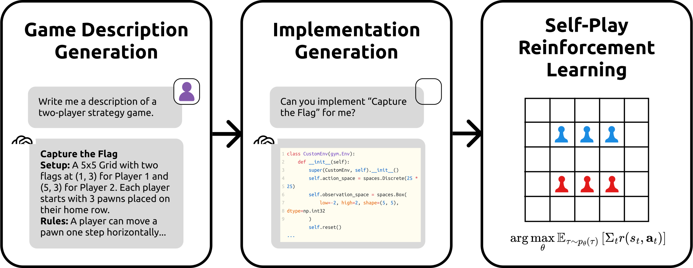

<h1 align="center">gg-bench: Measuring General Intelligence with Generated Games</h1>
<p align="center">
  <a href="https://www.vverma.com/" style="text-decoration: none;">Vivek Verma</a>,
  <a href="https://dh-davidhuang.github.io/davidh.io/" style="text-decoration: none;">David Huang</a>,
  <a href="https://verityw.github.io/" style="text-decoration: none;">William Chen</a>,
  <a href="https://people.eecs.berkeley.edu/~klein/" style="text-decoration: none;">Dan Klein</a>,
  <a href="https://people.eecs.berkeley.edu/~nicholas_tomlin/" style="text-decoration: none;">Nicholas Tomlin</a>
</p>
<p align="center">
  UC Berkeley
</p>
<p align="center">
<a href="https://arxiv.org/pdf/2505.07215">📃 Paper</a>
•
<a href="https://github.com/vivek3141/gg-bench" >💻 Code</a>
</p>

We present **gg-bench**, a collection of game environments designed to evaluate general reasoning capabilities in language models. Unlike other static benchmarks, gg-bench is a _data generating process_ where new evaluation instances can be regenerated at will. In particular, gg-bench is synthetically generated by (1) using a large language model (LLM) to generate natural language descriptions of novel games, (2) using the LLM to implement each game in code as an OpenAI Gym environment, and (3) training reinforcement learning (RL) agents via self-play on the generated games. 

<p align="center">

</p>

We evaluate language models by their winrate against these RL agents by prompting models with the game description, current board state, and a list of valid moves, after which models output the moves they wish to take. gg-bench is challenging: state-of-the-art LLMs such as GPT-4o and Claude 3.7 Sonnet achieve winrates of 7-9% on gg-bench using in-context learning, while reasoning models such as o1, o3-mini and DeepSeek-R1 achieve average winrates of 31-36%. We release the generated games, data generation process, and evaluation code in order to support future expansion of our benchmark.

## Setup
After cloning the project, install it with:
```
pip install -r requirements.txt
pip install -e .
```

In order to run evals on OpenAI models, the code looks for a `openai_config.yaml` file in the root directory with the following format:
```yaml
api_key: <api_key>
organization: <organization>
```
Likewise for Anthropic model evals, the code looks for a `anthropic_config.yaml` file in the root directory with the `api_key` entry only. For running DeepSeek or Llama models, the code uses the Together AI API that looks for the environment variable `TOGETHER_API_KEY`. The routers can be found in `gg_bench/utils/chat_completion`, and can be changed to route model completions to local endpoints if needed.

## Running the `gg-bench` pipeline

Upon installing the package, the command `gg-bench` should be available in `PATH`. This command will be used for all three stages of the `gg-bench` pipeline: dataset generation, RL agent training and filtering. In addition, the command serves as an endpoint for LLM evaluation.

### Dataset Generation

The dataset generation pipeline utilizes the configs `generate_descriptions.yaml`, `generate_envs.yaml` and `generate_actions.yaml` present in `gg_bench/configs`. These configs can be used to change the number of environments, the prompts used at each step and the model that runs the step of the pipeline. In order to run the pipeline, first delete the data present in `gg_bench/data` and run the following scripts in succession from the root directory.

```bash
gg-bench generate descriptions
gg-bench generate envs
gg-bench generate actions
```

These commands will create a `gg_bench/data` folder with subdirectories `descriptions`, `envs` and `actions` each of which contain `.txt` or `.py` files numbered starting from 1. These correspond to the environment indices present in the next commands.

### RL Agent Training

To run RL agent training, run the following command:

```bash
gg-bench train --id_range <start_idx> <end_idx>
```

> **Warning:** Multi-environment training (`--id_range`) spawns a separate process for each environment. Each process can be CPU- and memory-intensive. Launching too many environments at once may exhaust system resources and cause crashes or severe slowdowns. Monitor your system load carefully when using this option.

To run a single environment, you can use:

```bash
gg-bench train --env_id <env_id>
```

To see logs of the games being played, these commands can be supplied with a `--verbose` flag.

### Filtering

To run all stages of filtering, run the following command:

```bash
gg-bench filter --all
```

This will create a file `gg_bench/data/valid_envs.json` file containing a list of environments that passed filtering. The LLM evaluation pipeline looks for a list of tuples `(env_idx, rl_agent_step)` in the `valid_envs.json` file, so the final filtering step will need to be run, that does the pairwise comparison of RL agents described in Section 2.4:

```bash
gg-bench upper-bound-filter
```

> **Warning**: This will overwrite the file `gg_bench/data/valid_envs.json`, so make sure to make a backup of it before running in case of any issues.

### LLM Evaluation

To evaluate a LLM, make sure that the logic in `gg_bench/utils/chat_completion/chat_completion.py` routes to the model you wish to evaluate. Then, run the following command:

```bash
gg-bench eval --id_range <start_idx> <end_idx> --model <model>
```

> **Warning:** Multi-environment evaluation (`--id_range`) also spawns a separate process for each environment. Each process can be CPU- and memory-intensive. Launching too many environments at once may quicky use up API credits or system resources. Monitor and pre-compute the API cost when using this option.
This will create a JSON file in the `results` folder with the outputs. In order to resume evaluation from a given file, run:

```bash
gg-bench eval --id_range <start_idx> <end_idx> --model <model> --out_file <out_file>
```

To run evaluation on a single environment, you can use:

```bash
gg-bench eval --env_id <env_id> --model <model>
```

## Results

When running the `gg-bench` pipeline with OpenAI o1, we see the following results across models:

<div align="center">

| Model                  | Benchmark Score |
|:-------------------------|:-----------------|
| gpt-4o                  | 8.94 (± 2.77)    |
| gpt-4o-mini             | 7.64 (± 2.26)    |
| o3-mini                 | 31.08 (± 5.73)   |
| **o1**                  | **36.28 (± 5.95)** |
| claude-3.7-sonnet       | 9.53 (± 3.05)    |
| meta-llama-3.3-70B      | 7.42 (± 2.78)    |
| deepseek-r1             | 32.50 (± 5.14)   |

</div>

For each game, the language model plays 30 games against the RL agents, and we calculate the percentage of times the language model won. The score we give a language model is then the average of the winrates across all games. In brackets, we provide a 95% confidence interval. For more details, refer to the paper.

## Citing

If you found this work useful, we would really appreciate it if you cite it with:

```bibtex
@misc{verma2025measuringgeneralintelligencegenerated,
      title={Measuring General Intelligence with Generated Games}, 
      author={Vivek Verma and David Huang and William Chen and Dan Klein and Nicholas Tomlin},
      year={2025},
      eprint={2505.07215},
      archivePrefix={arXiv},
      primaryClass={cs.AI},
      url={https://arxiv.org/abs/2505.07215}, 
}
```
